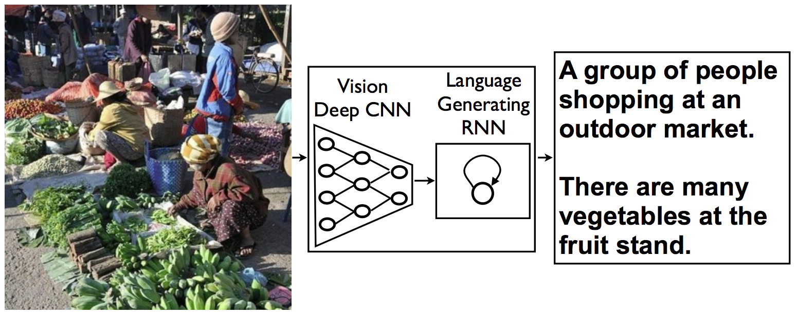

# Project : Image Captioning

## Description

In this project we combine Convolutional Neural Networks (CNN) and Recurrent Neural Networks (RNN) to build a deep learning model that produces captions given an input image.

One such example of how this architecture performs is pictured below:

<!--  -->

  

## Files

- `Notebook 0`: Explore MS COCO dataset using COCO API
- `Notebook 1`: Load and pre-process data from the MS COCO dataset and design the CNN-RNN model for automatically generating image captions
- `Notebook 2`: Training phase of the CNN-RNN model
- `Notebook 3`: Using the previously trained model to generate captions for images in the test dataset.
- `data_loader.py` : Custom data loader for PyTorch combining the dataset and the sampler
- `vocabulary.py` : Vocabulary constructor built from the captions in the training dataset
- `vocab.pkl` : Vocabulary file stored to load it immediately from the data loader

## CNN Encoder

The encoder is based on a Convolutional neural network that encodes an image into a compact representation.

The CNN-Encoder is a **ResNet** (Residual Network).

<!-- -->

  

## RNN Decoder

The CNN encoder is followed by a recurrent neural network that generates a meaningful sentence.

The RNN-Decoder consists of a <ins>single LSTM layer</ins> followed by <ins>one fully-connected (linear) layer</ins>, this architecture was presented from the paper `Show and Tell: A Neural Image Caption Generator (2014)` https://arxiv.org/pdf/1411.4555.pdf (figure **3.1**)

<!--  -->

  

## CNN-RNN model

By combining the CNN encoder and the RNN decoder, we can get a model that can find patterns in images and then use that information to help generate a description of those images - The input image will be processed by a CNN and we will connect the output of the CNN to the input of the RNN which will allow us to generate descriptive text.

  

